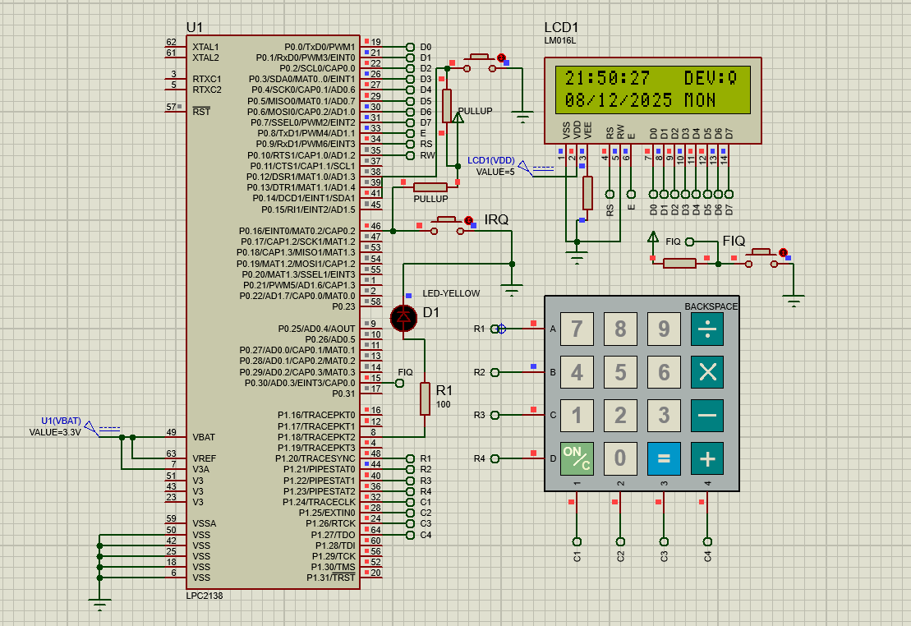

# ⚡ PowerChrono – The Future of Time-Driven Energy Automation

**PowerChrono** is an intelligent, time-based power management system designed to optimize energy usage in industrial environments.  
This project automates electrical device operation according to predefined time schedules — ensuring **efficient energy distribution**, **reduced wastage**, and **enhanced operational reliability**.

---

## 🌟 Features

- ⏰ Displays **real-time clock (RTC)** information (date & time) on a **16x2 LCD**.  
- 🔧 Allows users to **set or modify RTC and device ON/OFF timings** using a **4x4 matrix keypad**.  
- 💡 Controls a **device (LED or relay)** automatically based on scheduled timings.  
- 🧭 Provides **menu-based user interaction** using an external interrupt and switches.  
- ✅ Ensures **input validation** for all user entries (time/date and schedule inputs).

---

## 🧩 Hardware Connections

| Component | Function | LPC2129 Pin(s) |
|------------|-----------|----------------|
| **LCD Data (D0–D7)** | Data Lines | P0.0 – P0.7 |
| **LCD RS** | Register Select | P0.8 |
| **LCD EN** | Enable Signal | P0.9 |
| **4x4 Keypad** | Row & Column Inputs | P1.20 – P1.27 |
| **Interrupt Switch / Menu Access** | Opens Edit Menu | P0.16 |
| **Device Control Switch (On/Off Check)** | Checks Device Control | P0.10 |

---

## 🧠 How It Works

### 1️⃣ Initialization
All peripherals — LCD, Keypad, RTC, and Interrupts — are initialized in `main()`.

### 2️⃣ Super Loop
- Continuously reads RTC values.  
- Displays **real-time date and time** on the LCD.  
- Compares the current time with programmed ON/OFF schedules to control the connected device.

### 3️⃣ Device Control
Automatically turns the device **ON** or **OFF** based on RTC time matching the saved schedule.

### 4️⃣ Editing Mode
Press the **switch connected to P0.16** to enter the editing menu:
- **EDIT RTC Info:** Modify time/date (with validation).  
- **EDIT ON/OFF Time:** Set or update ON/OFF timings.  
- **EXIT:** Return to normal mode.

### 5️⃣ Menu Navigation
Use the **keypad** for menu selection and numeric inputs.  
Invalid inputs trigger **retry prompts** for correction.

---

## 🧰 Project Diagram

Here’s a visual overview of the **PowerChrono hardware setup and connections**.

---

## 🛠️ Software Requirements

- **Programming Language:** Embedded C  
- **IDE:** Keil µVision (MDK recommended)  
- **Programmer:** Flash Magic (for LPC21xx)  
- **Simulation (Optional):** Proteus or equivalent software  

---

## 🚀 Usage Instructions

1. **Power up** the system. LCD will display the current **time and date**.  
2. Use the **keypad** to edit:
   - RTC time and date  
   - ON/OFF timings  
3. Press the **menu switch (P0.16)** anytime to enter **editing mode**.  
4. Navigate using the keypad and input your values.  
5. The connected device automatically follows the saved schedule.

---

## 🧱 Code Structure

- **main.c:** Core logic for initialization, RTC display, and ON/OFF control.  
- **Interrupt Handlers:** Manage switch presses and user menu navigation.  
- **Validation:** Ensures correctness of all input data.

---

## 🧪 Simulation & Testing

1. Connect components according to the **pin mapping table**.  
2. Simulate the setup in **Proteus** or test on a **breadboard**.  
3. Verify:
   - RTC data displays correctly on LCD.  
   - Device responds accurately to programmed ON/OFF times.  
   - Menu navigation and editing function properly.

---

## 🚧 Future Enhancements

- 🌐 Integrate with **IoT dashboards** for remote monitoring.  
- ⚙️ Add support for **multiple devices** and **load prioritization**.  
- 📊 Include **energy consumption analytics** and reports.  

---

## 📜 License

This project is open-source and free to use for **educational and research purposes**.  
Developed with ❤️ to advance **smart energy automation** and **time-based power control**.

---

### 👨‍💻 Developed by: *[BOJANKI VENKATA SATYA ANAND]*  
### 🏫 Project Type: Embedded Systems / Energy Automation  
### ⚙️ Microcontroller: LPC2148 (ARM7)
